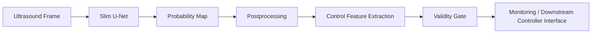
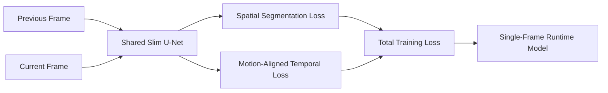

# Slim U-Net for Real-Time Bladder Ultrasound Segmentation

*Ultrasound segmentation model for Rosota / AURUS.*

An unofficial, paper-based PyTorch reimplementation of **Slim U-Net** for bladder
ultrasound segmentation, extended with **temporal-consistency training** and
**control-oriented output features** for a downstream robotic-ultrasound
controller.

---

## Project status

This repository contains an unofficial PyTorch reimplementation of
Slim U-Net based on the published paper by Raina et al.

It is not the official implementation released by the original
authors.

Some architectural details that were not explicitly specified in
the paper were inferred and are documented in this repository.

The original dataset and a working official implementation were not
available during development. Therefore, exact numerical reproduction
of the paper's reported results is not claimed.

**Reference paper**

> A. Raina et al., *"Slim U-Net: Efficient Anatomical Feature Preserving U-net
> Architecture for Ultrasound Image Segmentation"*, arXiv:2302.11524.

What *is* verified here: the reconstructed architectures reproduce both parameter
counts reported in the paper **exactly** (8,635,809 and 4,705,377). See
[Parameter-count reconstruction](#parameter-count-reconstruction).

What is **not** verified: any accuracy, latency or clinical claim. No
segmentation accuracy has been measured on real bladder ultrasound data — see
[Benchmark status](#benchmark-status).

---

## Project overview

The task is **binary segmentation of the urinary bladder lumen** in grayscale
B-mode ultrasound video. The intended downstream use is a robotic ultrasound
controller that keeps the bladder lumen clearly visible; this repository provides
the **perception half** of that loop:

```
                    -> Slim U-Net -> probability map -> postprocessing
one ultrasound frame    -> geometric control features -> validity gate -> Q_seg --.
                    |                                                             |-> controller
                    `-> raw B-mode quality (no network, no mask) ------> Q_raw ---'
```

Two quality functions, because the second one has to be defined before the first
one is: `Q_seg` presupposes that the bladder was found, `Q_raw` does not. See
[Two image-quality scores](#two-image-quality-scores).

Design commitments:

* **Lightweight model.** Slim U-Net performs one 3×3 convolution per encoder and
  decoder resolution instead of two, roughly halving the parameter count of a
  Standard U-Net at the same channel widths.
* **Stateless runtime.** Temporal information is used **only during training**,
  as a regulariser. The deployed model takes a single frame and holds no state,
  which keeps latency low and ONNX export trivial.
* **Explicit uncertainty about usability.** Every frame yields a `ControlState`
  with geometry, quality features, an explicit `valid_for_control` decision and
  machine-readable rejection reasons.
* **Patient-level everything.** Splits, reports and metrics are grouped by
  patient; frame-level random splitting is rejected by construction.

### Scope and safety statement

* This repository **does not control a robot.** It emits no velocities, forces,
  positions, joint targets or impedance parameters, and a test enforces that no
  such field ever appears in either output type (`ControlState`,
  `RawQualityResult`). It also owns no state machine: `valid_for_control` and
  `usable_for_contact_search` are *observation verdicts*, never commands, and
  what a controller does about them is out of scope here.
* It is **not a clinically validated medical device** and must not be used for
  diagnosis or treatment.
* All control thresholds and quality weights are **experimental defaults chosen
  for plausibility**, not values derived from any validation study.
* **External, patient-level validation and closed-loop testing are required**
  before any clinical or robotic deployment.

---

## System architecture



Training with temporal consistency:



Both frames pass through the **same weights**. The temporal term only shapes
those weights during training; at runtime the right-hand box is all that ships.

---

## Standard U-Net baseline

The original `milesial/Pytorch-UNet` model is preserved **unmodified** in
[unet/](unet/) and still serves the legacy scripts in the repository root. It is
the architectural baseline for every comparison.

[rus_perception/models/standard_unet.py](rus_perception/models/standard_unet.py) adds `StandardUNet`, a
generalisation of that model in which channel width, depth, convolution bias,
normalization and upsampling are configurable. Two presets:

| preset     | base channels | conv bias | upsampling                  | purpose |
|------------|---------------|-----------|-----------------------------|---------|
| `original` | 64            | `False`   | `ConvTranspose2d(k=2, s=2)` | Reproduces `unet.UNet` exactly |
| `paper`    | 32            | `True`    | `ConvTranspose2d(k=3, s=2)` | Reproduces the paper's 8,635,809-parameter baseline |

**Changes made to the original implementation: none.** `unet/unet_parts.py` and
`unet/unet_model.py` are byte-for-byte upstream. `StandardUNet` is a separate
class; at its default arguments it is verified *numerically identical* to
`unet.UNet` — same parameter count, same output for the same weights, in both
transposed-convolution and bilinear modes (see
`test_standard_unet_matches_the_original_implementation` in
[tests/test_models.py](tests/test_models.py)). `remap_legacy_unet_state_dict`
converts a legacy checkpoint to the new key names, validating every tensor shape.

Model selection is a configuration field:

```yaml
model:
  name: standard_unet   # or: slim_unet
```

The three experimental conditions this repository is built to compare:

```
Standard U-Net  vs.  Paper-based Slim U-Net  vs.  Slim U-Net + temporal-consistency loss
```

---

## Slim U-Net architecture

[rus_perception/models/slim_unet.py](rus_perception/models/slim_unet.py) implements `SlimUNet` as an
independent class — not an alias, not a renamed baseline.

**Input:** `B × 1 × H × W`, grayscale B-mode ultrasound.
**Output:** `B × 1 × H × W` **raw logits**.

`forward` never applies a sigmoid. Probabilities are produced by the caller for
inference, metrics, visualisation and control-feature extraction only, which
keeps `BCEWithLogitsLoss` numerically stable and makes the exported ONNX graph
identical to the trained one.

Channel progression (paper-faithful default): **32 → 64 → 128 → 256 → 512**.

Encoder stage — the defining difference from Standard U-Net:

```
3×3 padded convolution → BatchNorm → ReLU → Dropout(0.125) → 2×2 max pooling
```

One convolution per resolution instead of two. Decoder stage:

```
2× ConvTranspose2d(k=3, s=2) → concatenate encoder skip → 3×3 conv → BatchNorm → ReLU
```

Standard U-Net skip connections are preserved between corresponding resolutions.

Configurable: `input_channels`, `output_channels`, `channels`, `dropout`,
`decoder_dropout`, `dropout_kind`, `normalization`, `conv_bias`, `upsampling`,
`up_kernel_size`, `encoder_convs`, `decoder_convs`, and the input resolution.
`128 × 128` appears only as a default in configuration files, never hard-coded in
the model.

### Parameter-count reconstruction

The paper reports 8,635,809 trainable parameters for its Standard U-Net baseline
and 4,705,377 for Slim U-Net, but does not fully specify the decoder. Building
both models with 32→512 channels, 1-channel input and output, biased 3×3
convolutions each followed by BatchNorm and ReLU, `ConvTranspose2d(k=3, s=2)`
upsampling and a final 1×1 convolution — using **two** convolutions per stage for
the baseline and **one** convolution per stage, in *both* the encoder and the
decoder, for Slim U-Net — reproduces both published figures exactly:

| configuration | trainable parameters | paper | difference |
|---|---:|---:|---:|
| Standard U-Net, paper preset | **8,635,809** | 8,635,809 | **0 (exact)** |
| Slim U-Net, single-conv decoder | **4,705,377** | 4,705,377 | **0 (exact)** |
| Slim U-Net, double-conv decoder | 5,490,177 | 4,705,377 | +784,800 (rejected) |
| Standard U-Net, original milesial preset | 31,036,481 | — | different architecture |

Reproduce the table:

```bash
python scripts/architecture_report.py
```

**Decoder-variant comparison.** Both decoder variants remain constructible
(`decoder_convs: 1` or `2`). The single-convolution decoder was selected because
it is both the structurally consistent choice — the paper's stated contribution
is *fewer convolutions*, applied symmetrically — and the one that matches the
reported count exactly. No channel count or layer was manipulated to force the
match; the match fell out of those two structural choices.

The last row explains why a `standard_unet` trained with `preset: original` will
not match the paper's baseline figure: the upstream architecture uses
`base_channels=64`, bias-free convolutions and `k=2` transposed convolutions,
which is a different network. Use `preset: paper` for the paper comparison.

### Implementation details inferred from the paper

Recorded in code as `rus_perception.models.slim_unet.INFERRED_DETAILS` and printed by
`scripts/architecture_report.py`:

1. **Decoder stages use a single 3×3 convolution**, like the encoder. A
   double-convolution decoder gives 5,490,177 parameters versus the reported
   4,705,377; the single-convolution decoder matches exactly.
2. **Decoder upsampling is `ConvTranspose2d(kernel_size=3, stride=2, padding=1,
   output_padding=1)`.** `kernel_size=2` gives 3,834,977 (Slim) and 7,765,409
   (Standard) parameters and matches neither reported figure.
3. **3×3 convolutions carry a bias term** in addition to BatchNorm. Removing the
   bias gives 4,703,905 / 8,632,865 parameters, which no longer matches.
4. **The bottleneck** (deepest, 512-channel stage) is treated as a slim stage
   with a single convolution.
5. **Dropout placement**: after ReLU at the end of each encoder stage and the
   bottleneck. Decoder dropout is configurable and defaults to `0.0`, since the
   paper only describes dropout in the contracting path.
6. **Dropout is element-wise** (`nn.Dropout`), not channel-wise; `spatial` is
   available via `dropout_kind`. Dropout has no parameters, so this does not
   affect the counts.
7. **The output layer is a 1×1 convolution emitting raw logits**; the final
   activation lives outside the model.

Items 1–3 are *determined* by the reported parameter counts. Items 4–7 are
structural or stylistic choices the counts cannot distinguish.

### Estimated compute

Analytic multiply-accumulate counts for a single `1 × 1 × 128 × 128` forward pass
(forward hooks, **not** a measured runtime):

| model | trainable params | est. MACs | est. FLOPs |
|---|---:|---:|---:|
| Standard U-Net (paper preset) | 8,635,809 | 4.082 G | 8.164 G |
| Slim U-Net (paper preset) | 4,705,377 | 2.723 G | 5.446 G |

---

## Paper-faithful versus production configuration

```
paper preset:
architecture reproduction and baseline comparison

production preset:
higher-resolution input, temporal loss, control outputs,
monitoring, deployment preparation
```

| | `slim_unet_paper` | `slim_unet_production` | `slim_unet_temporal` |
|---|---|---|---|
| input size | 128 × 128 | 256 × 256 | 256 × 256 |
| architecture | identical — 4,705,377 parameters in all three |||
| temporal loss | off | off | **on** |
| postprocessing | threshold + largest component | + hole filling, contour smoothing | same |
| mixed precision | off | on (CUDA) | on (CUDA) |
| model selection | Dice only | Dice only | 0.8 × Dice + 0.2 × temporal IoU |

The production preset raises only the working resolution. The network is
unchanged, so it stays lightweight and export-friendly.

---

## Loss functions

### Spatial loss (paper-inspired)

$$
L_{\text{spatial}} = w_{\text{bce}} L_{\text{BCE}} + w_{\text{dice}} L_{\text{Dice}} + w_{\text{iou}} L_{\text{SoftJaccard}}
$$

For prediction probabilities $p = \sigma(z)$ and binary target $t$:

$$
L_{\text{BCE}} = -\frac{1}{N}\sum \left[\, t\log\sigma(z) + (1-t)\log(1-\sigma(z)) \,\right]
$$

$$
L_{\text{Dice}} = 1 - \frac{2\sum p t + s}{\sum p + \sum t + s}
\qquad
L_{\text{SoftJaccard}} = 1 - \frac{\sum p t + s}{\sum p + \sum t - \sum p t + s}
$$

Defaults: `bce_weight: 1.0`, `dice_weight: 1.0`, `jaccard_weight: 1.0`,
smoothing $s = 1.0$ (configurable).

* **BCE consumes logits** through `BCEWithLogitsLoss`.
* **Dice and Jaccard consume sigmoid probabilities**, never thresholded masks.
* The smoothing constant appears in **both** numerator and denominator, so an
  empty prediction against empty ground truth scores a perfect 0 instead of
  `0/0`. This is what makes all-zero masks safe.
* Every component is logged separately (`loss/bce`, `loss/dice`, `loss/jaccard`).
* A per-sample `sample_weight` masks frames without annotation, so unlabeled
  video contributes no spatial supervision.

### Temporal losses (this repository's addition, not from the paper)

Both terms compare the current prediction against the **motion-aligned** previous
prediction, never the unwarped one.

**Confidence-weighted pixel temporal loss**

$$
L_{\text{temp}}^{\text{pixel}} = \frac{\sum r \cdot \rho\!\left(p_{\text{cur}} - \mathrm{warp}(p_{\text{prev}})\right)}{\sum r + \epsilon}
$$

where $\rho$ is the Charbonnier penalty $\sqrt{x^2+\varepsilon^2}-\varepsilon$
(exactly zero at zero, so a perfectly aligned identical pair costs nothing) and
$r$ is the reliability map. A configurable robust L1 / smooth-L1 alternative is
available via `robust_kind`.

**Centroid and area consistency**

$$
L_{\text{temp}}^{\text{control}} = w_c L_{\text{centroid}} + w_a L_{\text{area}}
$$

$$
L_{\text{centroid}} = \left\lVert c_{\text{cur}} - c_{\mathrm{warp(prev)}} \right\rVert_2
\qquad
L_{\text{area}} = \frac{\lvert A_{\text{cur}} - A_{\mathrm{warp(prev)}} \rvert}{A_{\text{cur}} + A_{\mathrm{warp(prev)}} + \epsilon}
$$

with the differentiable soft centroid $c$ (normalized to $[0,1]^2$) and soft area
$A$ (mean probability), both computed from **soft probability maps** under the
same reliability weighting. Orientation, major-axis and eccentricity terms are
deliberately **not** included: they are unstable for small, partially visible or
nearly circular bladder masks.

**Total training loss**

$$
L_{\text{total}} = L_{\text{spatial}} + \lambda_{\text{pixel}} L_{\text{temp}}^{\text{pixel}} + \lambda_{\text{control}} L_{\text{temp}}^{\text{control}}
$$

Experiment defaults (**not** clinically validated):

```yaml
loss:
  temporal:
    lambda_temp_pixel: 0.2
    lambda_temp_control: 0.05
    temporal_warmup_epochs: 5
    ramp_epochs: 5
```

The whole temporal sum is scaled by a warm-up/ramp factor that is 0 during
warm-up and rises linearly to 1 over `ramp_epochs`.

### Why the losses are built this way

* **Why sigmoid probabilities for the soft losses.** Dice and IoU need a
  differentiable measure of overlap. A thresholded mask has zero gradient almost
  everywhere; soft probabilities give the optimiser a usable slope. Nothing is
  thresholded anywhere inside a loss.
* **Why logits are retained for BCE.** `BCEWithLogitsLoss` fuses sigmoid and log
  into a numerically stable expression; computing them separately overflows for
  confident predictions.
* **Why temporal alignment is required.** The probe and the anatomy move. Asking
  frame *t* to agree with frame *t−1* *unwarped* penalises exactly the motion the
  system exists to track, and rewards a model that predicts a static blob. Motion
  alignment removes the expected displacement so the loss sees only genuine
  inconsistency.
* **Why temporal consistency cannot replace segmentation supervision.** The
  temporal terms are minimised by *any* self-consistent output, including an
  empty mask. So spatial supervision stays active at all times, the control loss
  requires a minimum probability mass from both maps (`min_mass`), and warm-up
  delays the temporal term until the spatial objective has produced a usable
  segmentation.
* **Why unreliable flow regions are masked.** Optical flow fails at occlusions,
  out-of-plane motion, shadows and image borders. Enforcing agreement there would
  teach the model to reproduce flow errors. The reliability map gates the loss to
  zero where the evidence does not support it, and whole pairs below
  `min_reliable_ratio` are skipped and counted.
* **Why temporal stability does not guarantee anatomical accuracy.** A model that
  confidently and consistently segments the wrong structure scores perfectly on
  every temporal metric. This is why model selection weights spatial accuracy
  more heavily (0.8 vs 0.2), and why evaluation separately reports
  `stable_accurate`, `stable_inaccurate` and `unstable` frames.

Logged per step: `loss/bce`, `loss/dice`, `loss/jaccard`, `loss/spatial_total`,
`loss/temporal_pixel`, `loss/temporal_control`, `loss/temporal_centroid`,
`loss/temporal_area`, `temporal/raw_pixel_error`,
`temporal/weighted_pixel_error`, `temporal/reliable_pixel_ratio`,
`temporal/skipped_pairs`, `temporal/weight_factor`, `train/grad_norm`.
Non-finite losses and gradients are detected and the batch is skipped; gradient
clipping is configurable via `train.grad_clip`.

---

## Optical flow and reliability

### Direction convention

The most error-prone part of temporal consistency, so it is stated explicitly and
enforced by tests.

| field | defined on | points to | OpenCV call |
|---|---|---|---|
| `flow_backward` | **current** frame grid | previous frame | `calcOpticalFlowFarneback(current, previous, ...)` |
| `flow_forward` | **previous** frame grid | current frame | `calcOpticalFlowFarneback(previous, current, ...)` |

`warp_backward` consumes **`flow_backward`**:

```
previous_position   = current_position + flow_backward(current_position)
warped_prev[y, x]   = prev[y + dy, x + dx]
```

Handing `flow_forward` to `grid_sample` is the classic bug;
`test_forward_flow_used_as_a_sampling_grid_is_wrong` asserts it produces the
wrong result, and a synthetic-translation test verifies the correct field
reproduces a known displacement exactly (an object at *x* in the previous frame
and *x + Δ* in the current one is recovered with zero error).

Flow is **detached auxiliary information**: no gradient propagates into any flow
estimator in this version.

### Backends

| backend | use |
|---|---|
| `precomputed` | Load `.npz` flow written by `scripts/precompute_flow.py` (**recommended**) |
| `farneback` | OpenCV dense Farneback, computed on the fly |
| `raft_small` | `torchvision` RAFT-Small, optional dependency, run under `no_grad` |
| `identity` | Zero flow — **debugging only**; it asserts nothing moved, which is false for real video |

Recommended workflow: precompute forward and backward flow once, store it with
reliability maps and direction metadata, and load it during training rather than
recomputing dense flow every epoch.

### Reliability map

Bounded in `[0, 1]`, detached, built by multiplying soft scores so that *every*
signal must agree:

1. forward–backward flow consistency (also the occlusion proxy),
2. photometric reconstruction residual between the current frame and the aligned
   previous frame,
3. in-bounds sampling mask,
4. flow-magnitude ceiling,
5. image-border exclusion,
6. optional speckle decorrelation (windowed normalized cross-correlation).

Each residual maps to a score via `exp(-residual / (temperature × threshold))`,
or a hard threshold when `temperature = 0`. Configurable under
`flow.reliability`: `flow_consistency_threshold`, `photometric_threshold`,
`max_flow_magnitude`, `border_exclusion_px`, `temperature`,
`min_reliable_ratio`, `reliable_pixel_threshold`, `use_photometric`,
`use_speckle`, `speckle_window`, `speckle_threshold`.

---

## Dataset format

### Manifest

One CSV row per video frame:

| column | required | meaning |
|---|---|---|
| `patient_id` | yes | Subject identifier; the unit of splitting |
| `sequence_id` | yes | Sweep/video identifier, unique within a patient |
| `frame_index` | yes | Integer chronological position within the sequence |
| `image_path` | yes | B-mode frame |
| `mask_path` | no | Binary lumen annotation; empty = unlabeled frame |
| `timestamp` | no | Acquisition time in seconds |
| `split` | no | `train` / `val` / `test` |
| `flow_forward_path` | no | Precomputed previous→current flow |
| `flow_backward_path` | no | Precomputed current→previous flow |

Only the four required columns must exist. Unlabeled frames and missing flow are
first-class cases, not errors.

```
data/bladder/
├── manifest.csv
├── images/   P000_S00_0000.png ...
├── masks/    P000_S00_0000.png ...
└── flow/     P000_S00_000000_to_000001.npz ...
```

### Ordering, pairing and augmentation

* Records are sorted by `(patient_id, sequence_id, frame_index)`;
  `validate_ordering()` rejects non-increasing indices and timestamps that
  disagree with frame order. `validate_files()` reports missing images and masks.
* Pairs are formed **within a sequence only** — never across patients or sweeps.
  `data.temporal_interval` sets the gap (default 1 frame).
* **Geometric augmentation is shared** by both frames and both masks. Cropping,
  rotating, resizing or flipping the two frames independently would inject
  artificial motion that the temporal loss would then try to explain.
* **Optical flow is transformed with the geometry.** A displacement field is not
  a passive image: under a shared affine map `x → Ax + t` its support moves *and*
  its vectors become `Af`. Both effects are applied; resizing likewise rescales
  the vectors.
* Photometric augmentation is configured separately and, by default, uses the
  same parameters for both frames so the photometric reliability signal stays
  meaningful (`independent_photometric: false`).
* Augmentation is **opt-in**: a dataset built without an explicit augmentation
  config does not augment, so evaluation sets cannot be silently corrupted.
* Augmentation is deterministic given `(seed, sample_index)`.

### Patient-level splitting

Frames from one sweep are highly correlated, so random frame-level splitting
leaks a patient's anatomy from train into test and inflates every metric.
Splitting is therefore always at the `patient_id` level, and
`assert_no_patient_leakage` raises `PatientLeakageError` wherever splits are
consumed. Patient ordering comes from a seeded content hash, so a historical
split stays reproducible as the dataset grows.

Reports (written to `dataset_statistics.json` on every training run) cover
patients, sequences, frames, labeled/unlabeled counts, class occupancy and the
split distribution.

### Annotation policy

The default annotation is the **bladder lumen inner boundary** — the lumen
interior — because that is what the control-oriented geometric features are
computed from.

Ground-truth masks are **never modified silently**. Loading binarises any
non-zero label (0/1, 0/255 and boolean masks all work); resizing uses
nearest-neighbour interpolation, which introduces no dilation or label smoothing.
Nothing dilates a mask automatically.

The paper's boundary-inclusive annotation is **not reproduced**, because the
paper does not specify the expansion procedure precisely enough for an honest
reimplementation — applying an arbitrary morphological dilation and calling it a
reproduction would be a fabrication. Boundary-inclusive annotation, uncertain
boundary bands and soft boundary labels remain possible future experiments; the
standard lumen annotation is and stays the default, and any mask-generating
operation must be documented where it is introduced.

---

## Installation

Tested with **Python 3.12** on **Linux (Ubuntu 24.04, kernel 6.8)** using
**PyTorch 2.13.0+cpu**, NumPy 2.4.4, Pillow 12.2.0 and OpenCV 5.0.0. Other
versions are likely to work but have not been verified here.

```bash
git clone <this-repository>
cd Unet_seg

python3 -m venv venv
source venv/bin/activate        # Windows: venv\Scripts\activate
pip install --upgrade pip
```

**CPU only:**

```bash
pip install --index-url https://download.pytorch.org/whl/cpu torch torchvision
pip install -e .
```

**CUDA:** install the torch build matching your driver from
<https://pytorch.org/get-started/locally/>, then `pip install -e .`.
Everything runs on CPU; CUDA only changes speed and enables mixed precision.

**Optional extras**

```bash
pip install -e ".[onnx]"    # scripts/export_onnx.py (+ verification)
pip install -e ".[viz]"     # legacy predict.py --viz
pip install -e ".[dev]"     # pytest
pip install wandb           # legacy root train.py logging only
```

### The installed package

`pip install -e .` puts **one** top-level name on the import path:

```python
from rus_perception.inference import Predictor
from rus_perception.control import ControlState, compute_control_quality, compute_raw_quality
```

That matters for the intended downstream use. This repository is imported *into*
a robot control workspace, where a top-level package called `src` — the name
this package used to have — would collide with any other project laid out the
same way, and `utils` or `unet` would collide with almost anything. So:

* only `rus_perception/` is installed;
* `unet/`, `utils/` and the root-level `train.py` / `predict.py` / `evaluate.py`
  / `hubconf.py` are the **unmodified upstream** entry points. They stay
  importable when you run from a clone — which is all `tests/test_models.py`
  needs for its baseline-parity check — and are deliberately never installed;
* `scripts/` is not packaged either; those are `python scripts/x.py` entry
  points that bootstrap their own `sys.path` through `scripts/_common.py`, so
  the repository still works without being installed at all.

`requirements.txt` remains for a plain `pip install -r` workflow; the core
dependency list in `pyproject.toml` is kept in sync with it.

RAFT-Small optical flow needs a `torchvision` build that includes
`torchvision.models.optical_flow`. The Farneback backend needs only OpenCV, which
is a core dependency.

**Verify the installation** (no data or network needed):

```bash
python -m pytest tests/ -q
python scripts/architecture_report.py
```

---

## Quick start on synthetic data

No clinical data is required to exercise the whole pipeline:

```bash
python scripts/make_synthetic_dataset.py --output-dir data/synthetic \
    --patients 8 --frames 12 --size 128 128 --labeled-fraction 0.8

python scripts/precompute_flow.py --manifest data/synthetic/manifest.csv \
    --backend farneback --output-dir data/synthetic/flow --update-manifest

python scripts/train.py --config configs/slim_unet_temporal.yaml \
    --manifest data/synthetic/manifest.csv --epochs 5 --device cpu \
    --set model.input_size=[128,128] --set data.image_size=[128,128]
```

The generator imitates the *structure* of a bladder B-mode frame (dark anechoic
lumen, bright boundary, speckle, depth-gain gradient, occasional shadowing). It
is **not** a physical ultrasound simulator and must never be used to support an
accuracy claim.

---

## Real data: the PFUS pelvic-floor dataset

`scripts/prepare_pfus.py` converts the public **PFUS** dataset into this
repository's manifest format, which makes it the first real ultrasound data the
models here can be trained and validated on.

| | |
|---|---|
| Content | Pelvic-floor ultrasound, midsagittal plane |
| Patients | 110 (`P000` … `P109`), one sweep each |
| Frames | 14,852, **every frame annotated** |
| Annotation | Eight polygons per frame: Pubis, Urethra, Bladder, Uterus, Vagina, Anus, Rectum, Levator ani muscle |
| Frame size | Varies per patient (~700×500 to ~1250×815), scan-converted sector on black background |
| Source | Solís-Martín, García-Mejido, Sainz, Galán-Páez (Universidad de Sevilla), CC-BY-4.0 |

The polygons are stored in the pixel coordinates of the frame beside them, so
they are rasterised at the original resolution and resized with the image.

```bash
# unzip the release, then:
python scripts/prepare_pfus.py \
    --source ~/datasets/pfus/raw/data \
    --output-dir ~/datasets/pfus \
    --labels Bladder --qc-samples 16 --report-occupancy
```

This writes `masks/PXXX/frame_YYY.png` (binary, 0/255), `manifest.csv` with
patient-level `train`/`val`/`test` splits, `splits.json` recording the exact
assignment, and — with `--qc-samples` — mask-over-image overlays in `qc/` so the
rasterisation can be checked by eye before any training run.

**Only the requested labels become foreground.** The default `--labels Bladder`
reproduces exactly the binary bladder task the models, losses, control features
and metrics in this repository are built for; the other seven structures stay
background. `--labels` accepts several names, but the pipeline is binary, so
multiple labels are merged into one foreground class rather than kept apart.

Statistics of the default preparation (`seed=42`, ratios 0.7/0.15/0.15):

```
patients            : 110      train  10359 frames / 78 patients
sequences           : 110      val     2476 frames / 16 patients
frames              : 14852    test    2017 frames / 16 patients
labeled frames      : 14852
empty masks         : 0        bladder occupancy: mean 0.0388, min 0.0052, max 0.1604
```

Two properties of this dataset that matter when reading any number produced
from it:

* **Consecutive frames of one patient carry near-identical polygons** — the
  annotation was propagated along each sweep. The effective sample size is
  therefore closer to 110 than to 14,852, which is exactly why splitting is done
  at the patient level and never at the frame level.
* **The bladder is small and often close to empty** (3.9 % of the frame on
  average, 0.5 % at the minimum), unlike the filled bladders the Slim U-Net
  paper's task assumes. Dice on this dataset is therefore not comparable with
  the paper's reported figures.

Train and evaluate on it with the two ready-made configs:

```bash
python scripts/train.py    --config configs/pfus_bladder.yaml
python scripts/evaluate.py --config configs/pfus_bladder.yaml \
    --checkpoint checkpoints/pfus_bladder/best.pt --split test

python scripts/train.py    --config configs/pfus_bladder_slim.yaml
python scripts/evaluate.py --config configs/pfus_bladder_slim.yaml \
    --checkpoint checkpoints/pfus_bladder_slim/best.pt --split test
```

Both configs use the manifest's own splits (`split.strategy: manifest`), 256×256
input, per-image intensity normalisation and the same schedule, so the Standard
and Slim runs differ only in architecture. Horizontal flipping is disabled: the
midsagittal pelvic-floor view has a fixed anatomical left/right, and mirroring it
would teach an orientation that never occurs.

---

## Training

**Standard U-Net baseline**

```bash
python scripts/train.py --config configs/standard_unet_baseline.yaml
```

**Paper-based Slim U-Net**

```bash
python scripts/train.py --config configs/slim_unet_paper.yaml
```

**Temporally regularized Slim U-Net**

```bash
python scripts/train.py --config configs/slim_unet_temporal.yaml
```

**Resume training**

```bash
python scripts/train.py --config configs/slim_unet_temporal.yaml \
    --resume checkpoints/slim_unet_temporal/last.pt
```

**Disable the temporal loss (ablation)**

```bash
python scripts/train.py --config configs/slim_unet_temporal.yaml \
    --set loss.temporal.enabled=false \
    --output-dir checkpoints/ablation_no_temporal
```

**Further ablations**

```bash
# pixel term only
python scripts/train.py --config configs/slim_unet_temporal.yaml \
    --set loss.temporal.lambda_temp_control=0.0 --output-dir checkpoints/abl_pixel_only

# control-descriptor term only
python scripts/train.py --config configs/slim_unet_temporal.yaml \
    --set loss.temporal.lambda_temp_pixel=0.0 --output-dir checkpoints/abl_control_only

# decoder-variant comparison (does not match the paper's parameter count)
python scripts/train.py --config configs/slim_unet_paper.yaml \
    --set model.decoder_convs=2 --output-dir checkpoints/abl_double_decoder

# longer temporal interval
python scripts/train.py --config configs/slim_unet_temporal.yaml \
    --set data.temporal_interval=3 --output-dir checkpoints/abl_interval3
```

`--set KEY.PATH=VALUE` overrides any configuration value; values are parsed as
YAML, so `true`, `3`, `1.0e-3` and `[128,128]` keep their types.

### Checkpoints

`last.pt` and `best.pt` are written to `train.checkpoint_dir`. Each contains:

* model state, optimizer state, scheduler state, AMP scaler state,
* `epoch`, `best_metric`, `best_metric_name`, `global_step`, full `history`,
* the **complete resolved configuration**,
* `model_version`, `seed`,
* `git_commit` and `git_dirty` when the working tree is a git repository.

Saves are atomic (temporary file, then rename), so an interrupted save cannot
leave a truncated checkpoint.

**Model selection never uses training loss.** The criterion is a validation score

```
selection_score = (w_spatial · val_dice + w_temporal · val_temporal_iou) / (w_spatial + w_temporal)
```

with `w_spatial = 0.8`, `w_temporal = 0.2` by default. `w_spatial > 0` is
enforced at construction: a stable but anatomically wrong model must never win
model selection.

---

## Evaluation

```bash
python scripts/evaluate.py --config configs/slim_unet_temporal.yaml \
    --checkpoint checkpoints/slim_unet_temporal/best.pt
```

Writes `evaluation.json`, `frame_metrics.csv` and `control_states.jsonl`.

**Spatial metrics** — Dice, IoU, precision, recall, sensitivity, specificity,
HD95, connected-component failure rate, empty-mask false-positive rate,
missed-bladder rate. Reported per frame, per sequence, per patient and overall
with mean, standard deviation and median. Metrics undefined for a frame (HD95
with an empty mask; precision with no prediction) are reported as `null` and
excluded from the aggregate — never silently reported as zero.

HD95 is in **pixels** by default; set `evaluation.pixel_spacing` to the real
mm/pixel to obtain millimetres.

**Temporal-stability metrics**, on chronologically ordered sequences without
shuffling — warped temporal Dice and IoU, reliability-weighted probability
difference, normalized centroid jitter, relative area jitter, mask dropout rate,
invalid-control-frame rate, longest consecutive invalid interval, false-positive
and false-negative persistence, and the distribution of the temporal-stability
score.

Where ground truth exists, frames are classified as:

| class | meaning |
|---|---|
| `stable_accurate` | consistent over time **and** correct |
| `stable_inaccurate` | consistent over time but **wrong** |
| `unstable` | inconsistent over time |
| `unknown_accuracy` | stable, but no ground truth — never assumed correct |

**Latency metrics** — per-stage and end-to-end, warm-up excluded.

---

## Real-time monitoring

```bash
# video file
python scripts/live_monitor.py --config configs/realtime_monitor.yaml \
    --checkpoint checkpoints/best.pt --source path/to/video.mp4

# camera index
python scripts/live_monitor.py --config configs/realtime_monitor.yaml \
    --checkpoint checkpoints/best.pt --source 0

# stream URI
python scripts/live_monitor.py --config configs/realtime_monitor.yaml \
    --checkpoint checkpoints/best.pt --source rtsp://host/stream

# image directory
python scripts/live_monitor.py --config configs/realtime_monitor.yaml \
    --checkpoint checkpoints/best.pt --source data/synthetic/images

# headless, annotated video, JSONL + CSV logs
python scripts/live_monitor.py --config configs/realtime_monitor.yaml \
    --checkpoint checkpoints/best.pt --source path/to/video.mp4 \
    --headless --save-video runs/monitor/annotated.mp4 \
    --jsonl runs/monitor/states.jsonl --csv runs/monitor/states.csv
```

Four panels side by side, with bounded rolling sparklines beneath:

1. raw ultrasound frame,
2. segmentation overlay (contour, centroid, bounding box, image centre),
3. probability / uncertainty map,
4. control and temporal-stability values.

Overlaid values: FPS, model latency, end-to-end latency; centroid, center error
x/y, area ratio; segmentation confidence, boundary entropy, lumen contrast;
temporal warped IoU, centroid jump, area change, temporal stability score;
control quality score, validity status and rejection reasons.

Status colours: **green = valid**, **yellow = marginal or temporarily unstable**,
**red = invalid for control** (configurable under `monitor.status_colors`).

Sparklines (bounded `deque`, `monitor.history_length` samples) track area ratio,
centroid x, centroid y, segmentation confidence, temporal IoU, temporal-stability
score, control-quality score and latency. The full video is never retained.

> **Screenshot placeholder.** No screenshot of the monitor on real bladder
> ultrasound data is included, because no such data was available during
> development. Run the quick-start commands above to generate the view on
> synthetic data.

### Real-time pipeline behaviour

Capture, preprocessing, inference, postprocessing, control-state extraction,
display and logging are separate stages. Capture runs in its own thread and
pushes into a **bounded** queue (`monitor.max_queue_size`).

* For a **live** source, a full queue drops the *oldest* frame: for a control loop
  a fresh frame is worth more than a complete history, and a backlog adds
  unbounded latency between what the probe sees and what the controller is told.
  Dropped frames are counted and displayed.
* For a **replayable** source (video file, image directory) nothing is dropped —
  every frame is still available a moment later, so dropping would lose data for
  no latency benefit.
* End-of-stream, missing frames and transient camera read failures are handled;
  `SIGINT`/`SIGTERM` trigger graceful shutdown; camera handles and video writers
  are released in a `finally` block.
* Device paths are never hard-coded — a camera is addressed by index or URI from
  the CLI or config.
* Optional CUDA mixed precision; headless Linux execution is supported
  (`opencv-python-headless` is the declared dependency).
* Latency statistics exclude a configurable warm-up period.
* `monitor.snapshot_on_validity_change` saves an annotated snapshot whenever
  `valid_for_control` flips.

---

## ControlState interface

Every frame produces one `ControlState`
([rus_perception/control/state.py](rus_perception/control/state.py)). Example JSON:

```json
{
  "frame_id": 128,
  "timestamp": 12.84,
  "centroid_x_normalized": 0.53,
  "centroid_y_normalized": 0.47,
  "center_error_x": 0.03,
  "center_error_y": -0.03,
  "mask_area_ratio": 0.18,
  "segmentation_confidence": 0.91,
  "temporal_warped_iou": 0.87,
  "temporal_stability_score": 0.89,
  "control_quality_score": 0.85,
  "valid_for_control": true,
  "rejection_reasons": []
}
```

> **These values are illustrative**, not produced by a real run on clinical data.
> Real output additionally contains provenance, all latency fields, the bounding
> box, axis lengths, intensity features and the quality sub-scores.

### Coordinate system

```
top-left image corner = (0, 0)
x increases to the right
y increases downward
image center = (0.5, 0.5) in normalized coordinates

center_error_x = centroid_x_normalized - 0.5
center_error_y = centroid_y_normalized - 0.5
```

* positive `center_error_x` → the bladder is **right** of image center
* negative `center_error_x` → the bladder is **left** of image center
* positive `center_error_y` → the bladder is **below** image center
* negative `center_error_y` → the bladder is **above** image center

### Units

| field group | unit |
|---|---|
| `centroid_*_px`, `major_axis_length`, `minor_axis_length`, `bounding_box` | pixels |
| `centroid_*_normalized` | fraction of image width/height, `[0, 1]` |
| `center_error_*`, `normalized_centroid_jump` | fraction of image size, `[-0.5, 0.5]` |
| `mask_area_px` | pixels |
| `mask_area_ratio`, `largest_component_ratio`, `border_contact_ratio` | ratio, `[0, 1]` |
| `segmentation_confidence`, `mean_boundary_entropy`, `*_score` | `[0, 1]` |
| `lumen_surrounding_contrast` | normalized difference, `[-1, 1]`, positive when the lumen is darker |
| `orientation_degrees` | degrees from `+x` toward `+y`, `(-90, 90]` |
| `*_latency_ms` | milliseconds |
| `timestamp` | seconds |

Fields that could not be measured are `null`, never `0`. `mask_threshold` records
the probability threshold that produced `binary_mask`.

Selected definitions:

* `segmentation_confidence = mean(|2p − 1|)` — mean binary certainty over the
  frame. Transparent and threshold-free; **not** a calibrated probability of
  correctness.
* `mean_boundary_entropy` — mean normalized binary entropy of the probabilities
  in a band around the mask boundary. Crisp boundary → low; blurred → high.
* `border_contact_ratio` — fraction of the mask's own perimeter lying on the
  image edge, i.e. how cut off the lumen is by the field of view.
* `largest_component_ratio` — retained-component area over raw-mask area. `1.0`
  means the prediction was already a single blob.

### Serialization

`to_dict()` returns JSON-compatible values (numpy scalars converted, non-finite
floats become `null`). The dense `probability_map` and `binary_mask` are
**excluded by default** — writing them per frame would dominate a JSONL log and
slow the real-time loop — while `has_probability_map` / `has_binary_mask` always
report their presence. Pass `include_probability_map=True` /
`include_binary_mask=True` to serialise them as nested lists. `flat_record()`
gives a CSV-friendly row with a **stable column set** that does not depend on
whether temporal features were available on a given frame.

### Validity gate

Configurable criteria (`control.validity`; `null` disables one): minimum and
maximum mask area ratio, segmentation-confidence floor, maximum border-contact
ratio, minimum largest-component ratio, minimum temporal warped IoU, maximum
centroid jump, maximum relative area change, minimum lumen contrast, maximum
boundary entropy, minimum temporal-stability score, minimum control-quality
score.

Rejection reasons are machine-readable:

```json
[
  "mask_area_too_small",
  "low_segmentation_confidence",
  "excessive_centroid_jump"
]
```

Full set: `empty_mask`, `mask_area_too_small`, `mask_area_too_large`,
`low_segmentation_confidence`, `excessive_border_contact`, `fragmented_mask`,
`low_temporal_warped_iou`, `excessive_centroid_jump`, `excessive_area_change`,
`low_lumen_contrast`, `high_boundary_entropy`, `low_temporal_stability`,
`low_control_quality`.

Criteria whose inputs are unavailable are recorded as *skipped*, not failed, so
the first frame of a sequence is not rejected merely for lacking a predecessor
(unless `require_temporal: true`).

```
valid_for_control=false means the current observation should not be
treated as a reliable new control measurement.
```

It is **not** a command, and it does **not** assert that a previous state is
still valid. A downstream controller may hold position, reduce movement speed,
initiate reacquisition or trigger a safety stop — those policies are outside the
scope of this repository. A previous valid state is never silently reused as if
it were a new observation.

### Two image-quality scores

The repository defines **two** quality functions over the same frame. They are
not variants of each other — they answer different questions, are computed from
different inputs, and become defined at different moments:

| | `Q_seg` — [rus_perception/control/quality.py](rus_perception/control/quality.py) | `Q_raw` — [rus_perception/control/raw_quality.py](rus_perception/control/raw_quality.py) |
|---|---|---|
| question | *is the bladder usably imaged?* | *is the probe acoustically coupled at all?* |
| input | probability map + mask + previous state | raw B-mode frame only |
| needs the network | yes | **no** |
| defined when the bladder is not visible | **no** — `valid_for_control` is false and `Q` is undefined | yes |
| sub-scores | 8, incl. temporal | 4, none temporal |
| reason codes | `REJECTION_REASONS` (13) | `RAW_REJECTION_REASONS` (4), disjoint |
| config | `control.quality` | `control.raw_quality` |

`Q_raw` exists because every quantity in a `ControlState` presupposes the
bladder was found. Before that — at the start of a contact search, with a poor
acoustic window — there is no `Q` to optimise at all. A downstream controller
that has to establish contact *first* and image well *second* therefore needs a
score that is defined in the first regime, and that score must not depend on the
network, which is least trustworthy in exactly that regime.

They live in one package because they share the acquisition geometry: the
fan/sector ROI mask, the depth scale and the A-line convention are properties of
the ultrasound machine, not of either score. Defining them in two places
guarantees they drift apart.

Neither score is a robot command, and neither is clinically validated.

#### `Q_seg` — the control-quality score

$$
Q = \frac{\sum_i w_i s_i}{\sum_i w_i}
$$

over normalized sub-scores in `[0, 1]`: `segmentation_confidence`,
`mask_completeness`, `lumen_contrast`, `border_penalty`, `component_quality`,
`temporal_iou`, `centroid_stability`, `area_stability`. Every sub-score and
weight is logged (`quality_components`, and `quality_*` columns in the CSV).
Sub-scores whose inputs are unavailable are **dropped from the mean** rather than
scored zero, so a first frame is not penalised for having no predecessor. All
weights and normalisation scales are configurable under `control.quality`.

The default weighting is a *validity* weighting. For the Stage 1b force search
use `QualityConfig.for_force_search()` (`FORCE_SEARCH_WEIGHTS`): it zeroes the
temporal terms — changing the force changes the image, so stability would
reward standing still — and the area term, because contact force compresses
the bladder and mask area is confounded with force; with it in, the unvalidated
`target_area_ratio` would effectively pick the optimal force. What remains is
`boundary_sharpness` and `lumen_contrast`, plus `segmentation_confidence` at
low weight until the network is calibrated on the target domain.

> This is a transparent heuristic for *how usable this frame is as a control
> measurement*. It is **not clinically validated** and is not a measure of
> anatomical correctness or diagnostic image quality.

#### `Q_raw` — the segmentation-independent score

Same weighted-mean form, over four sub-scores computed per **A-line** — one
acoustic ray — because that is the unit in which acoustic coupling fails. An air
gap kills one ray completely rather than dimming the whole image.

| sub-score | definition | default weight |
|---|---|---|
| `near_field_echo` | near-field band mean, normalized by a reference intensity | 1.0 |
| `contact_continuity` | `1 −` fraction of A-lines whose near field is dark | **1.5** |
| `total_echo_energy` | plateau function of the ROI mean intensity | 0.5 |
| `shadow_penalty` | `1 −` fraction of A-lines whose far field collapsed | 1.0 |

`contact_continuity` carries the most weight because a dead A-line is the least
ambiguous evidence of an air gap; every other sub-score can be depressed by
anatomy alone.

Two design points worth stating because they are easy to get wrong:

* **Shadowing is judged relative to the frame's own unshadowed far-field level**,
  so a machine-side gain or TGC change does not register as new shadowing. The
  reference is a **high percentile, not the median** — past 50 % shadowed lines
  the median *is* the shadow level and a median-based test goes blind exactly
  when the frame is worst. A small absolute floor is the backstop for *uniform*
  far-field loss, where no unshadowed reference survives at all.
* **`score` is `None`, never `0.0`, when the frame could not be measured** (too
  few A-lines with ROI support). Zero would be indistinguishable from a
  genuinely terrible frame.

`sector` (curvilinear/phased) scan geometry does not sample image columns:
after scan conversion an A-line is a ray from the virtual apex, not a column,
and treating columns as A-lines would average across different depths. Instead
every pixel is assigned a radius and angle in the same fan geometry the ROI
mask uses, and the fan is binned into `depth_bins × n_a_lines` cells whose
means are the A-line samples — no interpolation, one definition of the fan.
It is configured by `fan` (`apex_xy`, `radius_range`, `half_angle_deg`, the
`roi.mode: fan` parameters) and still needs those three values from the
ultrasound machine before it measures anything ⏳.

**Stage 1a is a gate, not an optimiser.** `coupling_gate(result)` answers *is
the probe acoustically coupled?* — a score, no rejection reason,
`contact_continuity` at or above `gate_min_contact_continuity`, and a
near-field echo — and that yes/no is what hands over to Stage 1b, where the
search over force runs on `Q_seg` (see `QualityConfig.for_force_search()`
above). Nothing climbs `Q_raw`.

Reading the setpoint off a force sweep is `rus_perception/metrics/trust.py::
force_response`. It reports the *smallest* force tied with the maximum
(`f_left`) and, since the 2026-09-08 revision, adds a `margin_n` on top
(`f_star = f_left + margin_n`; `asymmetric_margin` gives 0.636 σ for the
design cost ratio w₋/w₊ = 5, so the setpoint does not sit on the edge of
contact loss), can replace the fixed ε tie with a Welch-type `z_alpha` rule
scaled by each level's standard error, corrects that standard error for the
lag-1 autocorrelation of hold-window frames (`n_eff`), and judges unimodality
by an umbrella (rise-then-fall) isotonic fit relative to the noise rather than
by counting sign changes alone.

> **Status.** The structure, config schema, reason codes and both A-line
> samplers are in place; every numeric default is provisional and marked
> `PROVISIONAL` in source. They cannot be fixed until the ultrasound image
> geometry is known (probe type, depth scale, fan parameters). **None of the
> four sub-scores has been shown to be monotone or unimodal in contact
> force.** That is an experiment, not an assumption — and it is why `Q_raw`
> is used as a coupling gate rather than as the search objective.

---

## Configuration

```
configs/
├── _base.yaml                    shared defaults (no model section)
├── standard_unet_baseline.yaml
├── slim_unet_paper.yaml
├── slim_unet_production.yaml
├── slim_unet_temporal.yaml
└── realtime_monitor.yaml
```

Configs inherit through a `defaults:` key. `_base.yaml` deliberately contains
**no `model` section**: model presets differ structurally between architectures,
so inheriting one would leak incompatible constructor arguments.

Configuration is validated at startup — unknown sections, unknown keys within a
typed section, an unknown model name, all-zero spatial loss weights, or a
temporal warm-up longer than the training run all fail immediately with an
explanatory message rather than silently changing behaviour.

| group | section | examples |
|---|---|---|
| **Model architecture** | `model` | `name`, `preset`, `channels`, `input_size`, `dropout`, `normalization`, `conv_bias`, `upsampling`, `encoder_convs`, `decoder_convs` |
| **Data and splits** | `data`, `split` | `manifest`, `image_size`, `intensity_normalization`, `temporal_interval`, `require_labeled_current`, `strategy`, `ratios`, `seed` |
| **Augmentation** | `augmentation` | flips, `rotation_degrees`, `scale_range`, `translate_ratio`, `brightness`, `contrast`, `gamma_range`, noise |
| **Training hyperparameters** | `train` | `epochs`, `batch_size`, `optimizer`, `scheduler`, `amp`, `grad_clip`, `device`, `checkpoint_dir`, `model_selection` |
| **Spatial loss weights** | `loss` | `bce_weight`, `dice_weight`, `jaccard_weight`, `smooth` |
| **Temporal loss weights** | `loss.temporal` | `lambda_temp_pixel`, `lambda_temp_control`, `temporal_warmup_epochs`, `ramp_epochs`, `robust_kind`, `detach_target` |
| **Optical-flow thresholds** | `flow`, `flow.reliability` | `backend`, `flow_consistency_threshold`, `photometric_threshold`, `max_flow_magnitude`, `border_exclusion_px`, `temperature` |
| **Postprocessing** | `postprocess` | `threshold`, `largest_component`, `min_component_area_ratio`, `fill_holes`, `smooth_contour` |
| **Control-validity heuristics** | `control.validity` | area bounds, confidence floor, border/component/temporal thresholds |
| **`Q_seg` weights (clinically unvalidated)** | `control.quality` | per-component `weights`, `target_area_ratio`, normalisation scales |
| **`Q_raw` bands and weights (all PROVISIONAL)** | `control.raw_quality` | `scan_geometry`, `fan` (sector apex/radius/angle), depth-band fractions, `dark_intensity_threshold`, `shadow_reference_percentile`, per-component `weights`, gate thresholds, `gate_min_contact_continuity` |
| **Monitoring** | `monitor` | queue size, drop policy, logs, snapshot, status colours |
| **Reproducibility** | `experiment`, `logging` | `seed`, `output_dir`, `level` |

No threshold that changes behaviour is buried in Python source.

---

## Repository structure

```
Unet_seg/
├── rus_perception/      THE INSTALLED PACKAGE -- the only thing pip puts on
│   │                    the import path
│   ├── models/          blocks.py, standard_unet.py, slim_unet.py, registry.py, report.py
│   ├── losses/          segmentation.py, temporal.py
│   ├── data/            manifest.py, splits.py, image_dataset.py, video_dataset.py,
│   │                    augment.py, io.py, synthetic.py
│   ├── flow/            base.py, backends.py, precomputed.py, warp.py, reliability.py
│   ├── control/         state.py, features.py, postprocess.py, validity.py,
│   │                    quality.py (Q_seg), raw_quality.py (Q_raw)
│   ├── metrics/         spatial.py, temporal.py, latency.py
│   ├── inference/       predictor.py, realtime.py, sources.py, visualization.py
│   ├── training/        trainer.py
│   └── utils/           config.py, checkpoint.py, logging_utils.py, seeding.py
├── scripts/             NOT packaged -- `python scripts/x.py` entry points
│   ├── train.py                 evaluate.py             infer.py
│   ├── live_monitor.py          precompute_flow.py      export_onnx.py
│   ├── benchmark.py             architecture_report.py  make_synthetic_dataset.py
│   ├── _common.py
│   └── download_data.sh / .bat  (original Carvana helpers)
├── configs/             _base.yaml + 5 experiment configs
├── tests/               test_models.py, test_losses.py, test_flow.py, test_data.py,
│                        test_control.py, test_raw_quality.py, test_metrics.py,
│                        test_pipeline.py, conftest.py
├── docs/
│   └── ORIGINAL_README.md       the upstream README, preserved verbatim
│
├── unet/                ORIGINAL Standard U-Net (unmodified upstream code)
├── utils/               ORIGINAL data loading and Dice helpers (unmodified)
├── train.py             ORIGINAL Carvana training entry point (preserved)
├── predict.py           ORIGINAL prediction entry point (preserved)
├── evaluate.py          ORIGINAL evaluation helper (preserved)
├── hubconf.py           ORIGINAL torch.hub entry point (preserved)
├── Dockerfile           ORIGINAL (preserved)
├── LICENSE              GNU GPL v3, inherited from milesial/Pytorch-UNet
├── pyproject.toml       packaging; installs rus_perception ONLY
├── requirements.txt
├── pytest.ini
└── README.md
```

The root-level `train.py`, `predict.py` and `evaluate.py` are the **original**
Carvana-oriented entry points, kept for backward compatibility. They are not
duplicates of the new pipeline: they are wandb-coupled, multi-class,
random-split, directory-based scripts that cannot express manifests, patient
splits, temporal pairs or YAML configuration. New work should use
`scripts/train.py`.

---

## Other commands

**Batch inference**

```bash
python scripts/infer.py --config configs/slim_unet_production.yaml \
    --checkpoint checkpoints/best.pt --input path/to/images
```

Add `--save-overlay`, `--save-probability`, `--threshold 0.6`, or use
`--split test` to run over a manifest split instead of a directory.

**Optical-flow precomputation**

```bash
python scripts/precompute_flow.py --manifest data/manifest.csv \
    --backend farneback --output-dir data/flow
```

Add `--update-manifest` to write the flow paths back, `--with-reliability` to
store precomputed reliability maps, and `--skip-existing` to resume. Every file
records its direction convention, frame identifiers and dimensions; corrupted,
truncated or dimension-mismatched files are detected on load rather than silently
producing zeros.

**ONNX export**

```bash
python scripts/export_onnx.py --checkpoint checkpoints/best.pt --output slim_unet.onnx
```

Exports a **single self-contained** `.onnx` file emitting raw logits, then
verifies it against PyTorch with `onnxruntime` when available (fails if the max
absolute logit difference exceeds `1e-3`). `--dynamic-spatial` marks height and
width dynamic; `--external-data` opts into the split `.onnx` + `.onnx.data`
layout for models above the 2 GB protobuf limit.

**Latency benchmark**

```bash
python scripts/benchmark.py --checkpoint checkpoints/best.pt --device cuda
python scripts/benchmark.py --model slim_unet --preset paper --device cpu --json bench.json
```

Reports model-only and end-to-end latency separately, with CUDA synchronisation,
warm-up, mean/median/p95, FPS, parameter count, estimated MACs and peak GPU
memory.

**Architecture report**

```bash
python scripts/architecture_report.py
python scripts/architecture_report.py --config configs/slim_unet_paper.yaml --layers 40
```

**Legacy entry points** (unchanged upstream behaviour)

```bash
python train.py --epochs 5 --batch-size 1 --scale 0.5 --classes 2
python predict.py -i image.jpg -o output.png --model MODEL.pth
```

See [docs/ORIGINAL_README.md](docs/ORIGINAL_README.md) for the upstream Carvana
instructions, Docker image and pretrained weights.

---

## Testing

```bash
python -m pytest tests/ -q
```

Or a single area:

```bash
python -m pytest tests/test_models.py -v      # architecture, parameter counts, baseline parity
python -m pytest tests/test_losses.py -v      # spatial + temporal losses, gradient flow
python -m pytest tests/test_flow.py -v        # warp direction, reliability, file validation
python -m pytest tests/test_data.py -v        # manifests, patient splits, paired augmentation
python -m pytest tests/test_control.py -v     # geometry, Q_seg, validity, serialization
python -m pytest tests/test_raw_quality.py -v # Q_raw sub-scores, reason codes, scan geometry
python -m pytest tests/test_metrics.py -v     # spatial, temporal, latency metrics
python -m pytest tests/test_pipeline.py -v    # config, training, inference, monitor, ONNX
```

**263 tests were passing** before `tests/test_raw_quality.py` was added; its 27
tests pass, but the full suite has **not** been re-run since the package rename
(`src` → `rus_perception`), so treat the combined figure as unverified until you
run it. Every test runs on synthetic data — none requires private clinical data
or a network connection. The ONNX test skips itself if `onnxruntime` is absent.

---

## Reproducibility

* **Seeds.** `experiment.seed` seeds Python, NumPy and PyTorch (CPU and CUDA);
  DataLoader workers get distinct, stable derived seeds. Augmentation is
  deterministic in `(seed, sample_index)`.
* **Patient splits.** Derived from a seeded content hash of the patient id, so the
  assignment is stable when unrelated patients are added or removed.
* **Configuration snapshots.** The fully resolved config is stored inside every
  checkpoint; `dataset_statistics.json` and `architecture_report.json` are written
  alongside it.
* **Checkpoint metadata.** Epoch, best metric and its name, model version, seed,
  git commit and dirty flag, full training history.
* **Model versions.** `model_version` propagates from the checkpoint into every
  `ControlState`, together with a content-hash `checkpoint_id`.
* **Logs.** `train.log`, `history.json`, JSONL and CSV control-state logs.

---

## Benchmark status

| quantity | status |
|---|---|
| Trainable parameter counts | **Measured** — exact match to both reported figures |
| Estimated MACs / FLOPs | **Computed analytically** (not a measured runtime) |
| PyTorch ↔ ONNX numerical agreement | **Verified** (< 1e-3 max logit difference) |
| Segmentation accuracy (Dice, IoU, HD95) on bladder ultrasound | **Measured on PFUS** — see below. Pelvic-floor midsagittal data, *not* the paper's task |
| Reproduction of the paper's reported accuracy | **Not attempted** — the paper's dataset is still unavailable |
| Temporal-stability metrics on clinical video | **Measured on PFUS** — see below |
| Inference latency / FPS on target hardware | **Measured** on an RTX 4090 at 256×256 — see below |
| GPU memory usage | **Not yet benchmarked** |
| Benefit of the temporal loss over the spatial-only baseline | **Not yet benchmarked** |
| Validity-gate and `Q_seg` threshold calibration | **Not yet benchmarked** |
| `Q_raw` sub-score monotonicity/unimodality in contact force | **Not yet benchmarked** — since 2026-09-08 `Q_raw` is the Stage 1a *coupling gate* (`coupling_gate`) and the force search climbs `Q_seg` (`QualityConfig.for_force_search()`), so what has to be shown is that the gate separates coupled from uncoupled, and that `Q_seg` is unimodal in force (`force_response`) |
| `Q_raw` band, ROI and threshold calibration | **Not yet benchmarked** — blocked on the ultrasound image geometry. Sector geometry is supported via bin-based A-line sampling (`fan`), but the machine's apex, radius range and sweep angle are still needed ⏳ |

Everything marked *Not yet benchmarked* has a command in this README that
produces the number. None of them is estimated, extrapolated or quoted from the
paper.

### First real-data results (PFUS, test split)

40 epochs, 256×256, identical schedule for both architectures; model selection on
the validation split, metrics from the untouched test split (16 patients, 2,017
frames). Commands are the ones in [Real data: the PFUS pelvic-floor
dataset](#real-data-the-pfus-pelvic-floor-dataset).

| | Standard U-Net | Slim U-Net |
|---|---|---|
| best val Dice (epoch) | 0.7506 (7) | 0.7530 (25) |
| test Dice | **0.731** ± 0.206 | 0.698 ± 0.269 |
| test Dice, median | 0.788 | **0.805** |
| test IoU | **0.610** | 0.588 |
| precision / recall | 0.733 / **0.762** | **0.793** / 0.705 |
| HD95 (px) | 15.5 | **13.7** |
| missed-bladder rate | **0.05 %** | 6.6 % |
| warped temporal IoU | **0.940** | 0.928 |
| invalid control frames | **3.0 %** | 10.7 % |
| inference / end-to-end (RTX 4090) | 1.13 / 3.03 ms | **0.82 / 2.64 ms** |

Read these as a pipeline validation and an architecture comparison, not as an
accuracy claim for a bladder-tracking controller:

* **The mean hides the failure mode.** Slim U-Net has the better *median* Dice
  and the better HD95 but the worse mean, because it loses the bladder entirely
  on 6.6 % of frames (0.05 % for the Standard U-Net) — and a controller reacts to
  exactly those frames. Its higher invalid-control-frame rate says the same thing
  from the gate's side.
* **Per-patient variance dominates.** Test Dice ranges from 0.92 (P041) to 0.28
  (P021) for the Standard U-Net, and P021 collapses to 0.08 for the Slim U-Net.
  Two of sixteen patients account for most of the gap between the mean and the
  median.
* **Stability is not correctness.** 444 of 2,017 test frames are classified
  `stable_inaccurate`: temporally consistent and anatomically wrong.
* Validation Dice was reached at epoch 7 (Standard) and then flat while the
  training loss kept falling — the run is overfit well before epoch 40.

One calibration note already observable on synthetic data: the default
`min_segmentation_confidence: 0.50` rejects under-trained models, because
`segmentation_confidence = mean(|2p − 1|)` stays low while a model still hedges
around 0.5. That is the gate working as intended, but it means the threshold must
be recalibrated per trained model rather than accepted as given.

---

## Limitations

**Domain and acquisition**

* Ultrasound-machine domain shift: models trained on one system frequently fail
  on another.
* Variation in gain, depth, TGC, dynamic range and probe orientation changes
  appearance drastically; the intensity-normalisation options here are a partial
  mitigation at best.
* Acoustic shadowing from bowel gas or bone can hide part or all of the lumen.
* Reverberation and other artefacts can produce structures resembling a lumen
  boundary.
* Incomplete bladder visibility: a bladder extending beyond the field of view
  makes the centroid a biased estimate of the true anatomical centre — the reason
  `border_contact_ratio` exists.

**Temporal assumptions**

* Speckle decorrelation from out-of-plane motion breaks the brightness-constancy
  assumption underlying optical flow.
* Optical flow is unreliable at occlusions, near borders and under large or rapid
  motion. The reliability map suppresses these regions but cannot repair them.
* Temporal stability is **not** anatomical accuracy. A confidently and
  consistently wrong prediction — a stable false-positive mask on a bowel loop or
  a cyst — scores perfectly on every temporal metric. This failure mode is
  measurable only against ground truth, which is why evaluation reports
  `stable_inaccurate` separately.

**Annotation and evaluation**

* Bladder boundaries in ultrasound are genuinely ambiguous; inter-observer
  variability limits achievable Dice regardless of model quality.
* The paper's boundary-inclusive annotation is not reproduced, so results here
  are not directly comparable to the paper's numbers.
* The synthetic dataset supports no accuracy claim whatsoever.

**Method and deployment**

* The control-quality score is a heuristic with hand-chosen weights, not a
  validated measure.
* Validity thresholds are experimental defaults and need per-system calibration.
* No clinical validation of any kind has been performed.
* External, patient-level validation on data from multiple machines and operators
  is required before any deployment claim.
* Closed-loop robot testing — with a real controller, real latency and real
  safety monitoring — is required before robotic deployment. Open-loop perception
  metrics do not predict closed-loop behaviour.
* Nothing here addresses regulatory approval, risk management or human-factors
  validation.

---

## Licensing and attribution

This repository is derived from
[milesial/Pytorch-UNet](https://github.com/milesial/Pytorch-UNet) and remains
licensed under the **GNU General Public License v3.0**. See [LICENSE](LICENSE);
the license file is unmodified and all copyright notices are preserved.

**Components from the original repository (unmodified):**

* `unet/unet_model.py`, `unet/unet_parts.py`, `unet/__init__.py` — the Standard
  U-Net implementation
* `utils/data_loading.py`, `utils/dice_score.py`, `utils/utils.py` — Carvana data
  loading and Dice helpers
* `train.py`, `predict.py`, `evaluate.py`, `hubconf.py` — original entry points
* `Dockerfile`, `scripts/download_data.sh`, `scripts/download_data.bat`,
  `.github/workflows/main.yml`, `LICENSE`
* `docs/ORIGINAL_README.md` — the upstream README, preserved verbatim

**Newly implemented in this work:** everything under `rus_perception/`, `configs/`,
`tests/`, and every script in `scripts/` except the two original `download_data.*`
files. `rus_perception/models/standard_unet.py` is a new, generalised implementation whose
default configuration is verified numerically identical to the original
`unet.UNet`; the original class itself was not modified.

**Slim U-Net is an independent, paper-based implementation.** It was written from
the published description in arXiv:2302.11524. No code was copied from the
authors or from any other repository, and no code under an incompatible license
was incorporated.

---

## References

1. A. Raina et al., *"Slim U-Net: Efficient Anatomical Feature Preserving U-net
   Architecture for Ultrasound Image Segmentation"*, arXiv:2302.11524.
   <https://arxiv.org/abs/2302.11524>
2. *"Temporally Stable Video Segmentation Without Video Annotations"*,
   arXiv:2110.08893. <https://arxiv.org/abs/2110.08893> — motivates using
   temporal consistency as a training-time regulariser while keeping the runtime
   model single-frame.
3. G. Farnebäck, *"Two-Frame Motion Estimation Based on Polynomial Expansion"*,
   SCIA 2003, LNCS 2749, pp. 363–370 — the dense optical-flow method used by the
   default backend (`cv2.calcOpticalFlowFarneback`).
4. Z. Teed and J. Deng, *"RAFT: Recurrent All-Pairs Field Transforms for Optical
   Flow"*, ECCV 2020, arXiv:2003.12039 — the optional `raft_small` backend.
5. O. Ronneberger, P. Fischer and T. Brox, *"U-Net: Convolutional Networks for
   Biomedical Image Segmentation"*, MICCAI 2015, arXiv:1505.04597 — the base
   architecture.
6. milesial, *Pytorch-UNet*. <https://github.com/milesial/Pytorch-UNet> — the
   upstream repository this work extends.

No benchmark result or accuracy figure in this document is fabricated. Where a
number has not been measured, this README says so explicitly.
