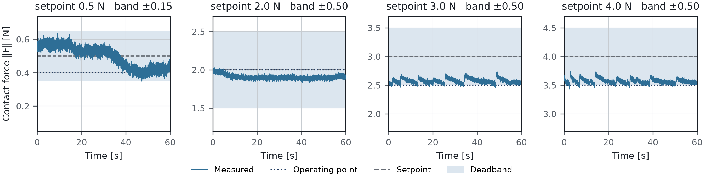
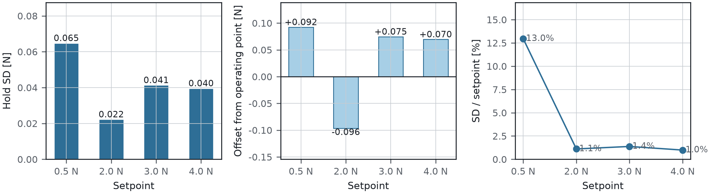
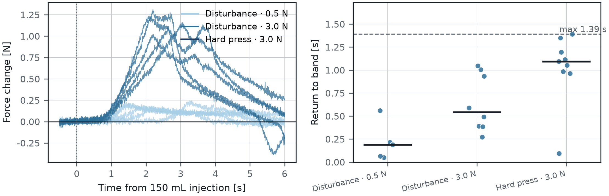
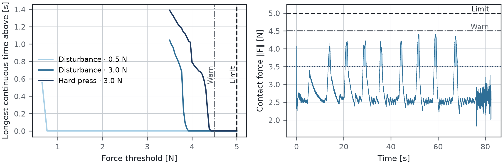
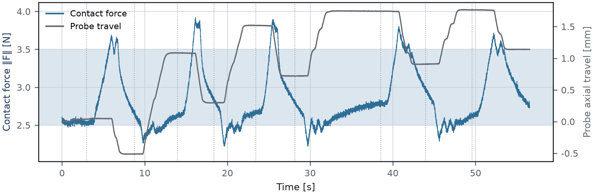

# Force-controlled contact: first validation

## 1. Method

A convex ultrasound probe on an FR5 arm was brought into contact with an
abdominal phantom whose internal volume is set by a 500 mL syringe. The control
stack (`us_diff_ik`) closes an admittance loop on the probe penetration axis:
once the contact force crosses an entry threshold the arm switches to contact
velocity limits and holds the force itself, leaving the operator no axis.

All forces are the **contact-force magnitude** `‖F‖ = √(Fx²+Fy²+Fz²)` in the
compensated probe frame — the same scalar the controller compares against its
setpoint and its limits. Force is read from the PX6D six-axis sensor over its
own USB link at 1 kHz, gravity- and payload-compensated, and referenced to the
probe contact point. Every sample the controller acted on was recorded; nothing
was filtered before analysis.

Three measurements were made:

- **Hold.** The probe was settled on the phantom and held for 60 s at each
  setpoint, with no operator input and no volume change.
- **Disturbance.** With the force loop closed, 150 mL was injected and withdrawn
  repeatedly while recording. Each syringe action was timestamped at its onset.
- **Exposure.** Every interval in which the force left the intended band was
  measured, together with the time taken to return.

Probe pose was logged alongside force at the flange, and axial travel is the
displacement projected onto the probe penetration axis.

**Table 1 — Configuration**

| Setpoint [N] | Deadband [N] | Entry [N] | Release [N] | Operating point [N] | Warn / Limit [N] |
|---:|---:|---:|---:|---:|---:|
| 0.5 | ±0.15 | 0.40 | 0.20 | 0.40 | 4.5 / 5.0 |
| 2.0 | ±0.50 | 2.00 | 0.30 | 2.00 | 4.5 / 5.0 |
| 3.0 | ±0.50 | 2.00 | 0.30 | 2.50 | 4.5 / 5.0 |
| 4.0 | ±0.50 | 2.00 | 0.30 | 3.50 | 4.5 / 5.0 |

## 2. Force holding

The regulator holds a band rather than a point: inside the deadband it commands
zero velocity, so the force settles where it first enters the band and stays
there. The operating point in Table 1 is that entry force. Deviation from it is
the tracking quality; standard deviation is independent of band width and is
therefore the figure that compares setpoints directly.

**Figure 1** — 60 s of held force at each setpoint.

**Table 2 — Hold quality**

| Setpoint [N] | Duration [s] | Samples | SD [N] | Offset [N] | SD / setpoint [%] | In band [%] |
|---:|---:|---:|---:|---:|---:|---:|
| 0.5 | 57 | 57,118 | **0.065** | +0.092 | 13.0 | 100.0 |
| 2.0 | 57 | 57,113 | **0.022** | -0.096 | 1.1 | 100.0 |
| 3.0 | 57 | 57,116 | **0.041** | +0.075 | 1.4 | 98.9 |
| 4.0 | 57 | 57,111 | **0.040** | +0.070 | 1.0 | 98.6 |

**Figure 2** — Stability, offset and relative stability against setpoint.

Hold SD is 0.022–0.065 N across a setpoint range of 0.5–4.0 N, with no trend
against setpoint. In relative terms the loop is tighter at higher forces —
1.0–1.4 % of setpoint above 2 N — because the noise floor is fixed by the sensor
rather than by the controller. Tracking offset from the operating point stays
within 0.10 N at every setpoint.

## 3. Disturbance rejection

**Figure 3** — Force change aligned on each 150 mL injection, and the time taken
to return inside the band.

**Table 3 — Band excursions**

| Run | Setpoint [N] | Band top [N] | Excursions | Median return [s] | Max return [s] | Peak ‖F‖ [N] |
|---|---:|---:|---:|---:|---:|---:|
| Disturbance · 0.5 N | 0.5 | 0.65 | 5 | 0.19 | **0.56** | 0.74 |
| Disturbance · 3.0 N | 3.0 | 3.50 | 8 | 0.54 | **1.05** | 3.92 |
| Hard press · 3.0 N | 3.0 | 3.50 | 9 | 1.09 | **1.39** | 4.41 |

Twenty-two excursions were recorded across the three runs. Every one returned
inside the band, the slowest in 1.39 s and the median in 0.19–1.09 s depending
on setpoint.

**Figure 4** — Longest continuous time spent above a given force, and the
hardest-pressed run.

**Table 4 — Exposure**

| Run | Peak ‖F‖ [N] | > 3.5 N | > 4.0 N | > 4.5 N (warn) | > 5.0 N (limit) |
|---|---:|---:|---:|---:|---:|
| Disturbance · 0.5 N | 0.74 | 0 | 0 | 0 | 0 |
| Disturbance · 3.0 N | 3.92 | 1.05 | 0 | 0 | 0 |
| Hard press · 3.0 N | 4.41 | 1.39 | 0.79 | 0 | 0 |

Peak force reached 4.41 N against a 5.0 N limit. Time spent continuously above
the 4.5 N warning level was zero in every run.

## 4. Direct evidence of regulation

**Figure 5** — Contact force and probe axial travel during the disturbance run.

The arm moves against the disturbance. Each injection lifts the phantom surface
into the probe; the force rises, the probe retreats, and the force returns to
the band. Over the run the probe travels 2.29 mm along its penetration axis
while the force stays within 3.0 ± 0.5 N — the displacement is the volume the
loop absorbed.

## 5. What this establishes

- The loop **holds a commanded contact force** from 0.5 N to 4.0 N with a
  stability of 0.02–0.07 N, set by the sensor noise floor rather than by the
  controller.
- Holding stability is **flat across the range**, so setpoint selection can be
  driven by imaging requirements rather than by control performance.
- The loop **returns the force to its band after an external disturbance**,
  every time, within 1.4 s.
- Under repeated 150 mL volume changes the force **stayed clear of the warning
  level entirely**, with 0.59 N of margin to the hard limit at its worst.
- The mechanism is **motion, not tolerance**: the probe travels millimetres
  along its own axis to keep the force constant.
