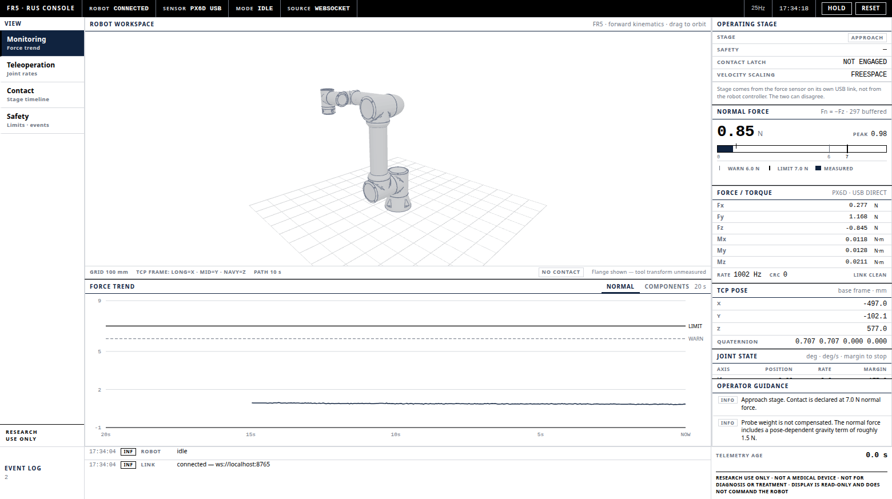
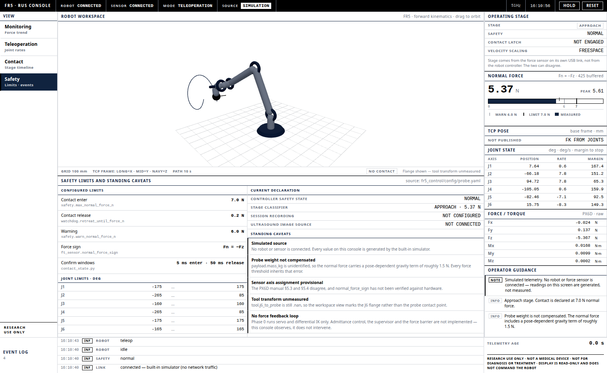

# Robotic Ultrasound Teleoperation Monitor

A desktop telemetry monitor for the FR5 right-arm ultrasound probing cell.
It watches robot and force-sensor telemetry, draws the arm from the joint
angles, shows which operating stage the system is in, and gives the operator
short guidance tied to what it is actually reading.

> **Research use only.** This is not a medical device. It is not cleared or
> approved for diagnosis or treatment, and it does not support autonomous
> clinical operation. The application **cannot move the robot**: the only
> commands it sends are the sensor-calibration steps (capture, fit, save,
> reset), which the bridge accepts from a fixed allowlist and which never
> command motion. The operator moves the arm by hand. Motion belongs to the
> ROS 2 stack that owns the velocity clamps and watchdogs.



## Running it

```bash
npm install
npm run console          # Electron window on the workstation's display
npm run build            # typecheck + production build
```

From an SSH session `npm run console` still opens the window on the machine's
own monitor — [`scripts/run-on-console.sh`](scripts/run-on-console.sh) supplies
`DISPLAY` and the X credentials, and refuses with a clear message rather than
starting blind if the seat is not there.

To review the interface in a browser instead: `npx vite --port 5173`.

## Connecting to the robot

The console follows a real session. It does not generate motion, and with no
source connected it shows **NO TELEMETRY** and a still arm.

Start the bridge on the workstation running the Phase 0 stack:

```bash
ros2 run fr5_control telemetry_bridge --ros-args \
  --params-file "$(ros2 pkg prefix fr5_control)/share/fr5_control/config/probe.yaml"
```

The parameter file is required, not optional. The bridge derives the stack
geometry it needs for wrench compensation — mounting angle, sensor-to-probe
lever arm, flange-to-sensor rotation — from `probe.yaml`, and refuses to start
without it rather than falling back to zeros. A zero lever arm is invisible
under axial compression (`r ∥ f`), which is exactly how it went unnoticed
before. `scripts/start_session.sh` passes the file for you.

It subscribes to the stack's own topics and republishes them in this contract:

| Topic | Carries |
|---|---|
| `/fr5_right/joint_states` | joint positions, velocities |
| `/fr5_right/ee_wrt_base` | TCP pose |
| `/fr5_right/wrench` | force/torque, when the controller has a sensor |

The bridge is **subscribe-only**. It publishes nothing and discards anything
arriving on the socket; the single path that moves the robot stays with the
control stack that owns the velocity clamps and watchdogs.

### Force

Our PX6D is the USB variant, so `robot_state_pkg.ft_sensor_data` is empty and
`/fr5_right/wrench` carries nothing real. Point the bridge at the sensor
directly:

```bash
sg dialout -c "ros2 run fr5_control telemetry_bridge --ros-args \
  --params-file $(ros2 pkg prefix fr5_control)/share/fr5_control/config/probe.yaml \
  -p bridge.px6d_port:=/dev/ttyACM0"
```

Each wrench frame reports its `source`, and the console names it — the header
reads `PX6D · USB DIRECT` or `VIA CONTROLLER` rather than claiming PX6D
whatever is feeding it. When the sensor is read directly the plate also shows
the measured sample rate and the CRC count since the stream synchronised, so
"the numbers look wrong" and "the cable is bad" can be told apart without
leaving the console.

**The readout rate and the trace rate are different numbers, deliberately.**
The bridge sends one wrench frame a second (`bridge.wrench_hz`), because that
is the rate at which a figure on a screen can actually be read — faster and it
is only the last digits moving. A line is not a figure, though, and at one
point a second a 20 s trend is a twenty-step staircase drawn from a 1 kHz
sensor. So each frame also carries that second's *shape*, folded into 10 ms
bins of mean plus min/max (`bridge.wrench_waveform_hz`, default 100, `0`
disables). The frame rate does not change — a 1 kHz stream sent frame-by-frame
would be a thousand JSON messages a second, and the console would spend the
budget parsing rather than drawing.

The trend plate shades the min/max band under the mean line and labels itself
with the bin rate, so a bin's worth of chatter that the mean erases is still on
the plot. Bins are folded, never sampled: picking one reading per bin would
alias, which is the failure that makes a resting probe look noisy and a
chattering one look calm. Frames without a waveform block — a controller-sourced
wrench, or `bridge.wrench_waveform_hz: 0` — draw one point per frame and the
plate drops the label rather than implying a resolution it does not have.

### Other transports

`websocket` (the bridge, default), `http`, `rosbridge`, and `simulation`. See
[`.env.example`](.env.example). `rosbridge` needs `rosbridge_suite`, which is
not installed on this workstation. `simulation` generates telemetry for
reviewing the interface without hardware and must be asked for explicitly —
every panel labels it while it is on.

## Visual system

An operational console in the FAIRINO FR-series idiom: black canvas, white
information plates, square corners, 1px rules. Three colours carry everything —
black `#000000`, white `#ffffff`, deep navy `#10233f` — with `#d6d9de` for rules
and `#6b7280` for de-emphasised text.

Navy is reserved: the selected navigation item, the active tab underline,
section headers, the measured value on the force scale, and the joints and
flange path in the workspace. Nothing else is coloured.

**No state is signalled by colour alone.** Severity is structural:

| Level | How it reads |
|---|---|
| normal | plain row, hairline rule |
| warning | 2px black left edge, `WARN` tag, heavier rule |
| alarm | inverted block — white on black — plus an `ALARM` tag |

That survives a monochrome pendant, a photocopy and colour-blind vision. The
trade-off is real and worth stating: an inverted block is less instantly
arresting at a distance than a red lamp, so the console leans on the event log
and the guidance column to carry urgency in words.

## Layout

```
SYSTEM │ ROBOT: CONNECTED │ SENSOR: CONNECTED │ MODE: TELEOPERATION │ SOURCE
───────┬──────────────────────────────────────────────┬────────────────────
 VIEW  │ Robot workspace                              │ Operating stage
 Monit.│ FR5 + TCP frame + 10 s flange path           │ Normal force
 Teleo.├──────────────────────────────────────────────┤ TCP pose
 Contact│ force trend │ joint travel │ mode timeline  │ Joint state
 Safety │            │ safety limits                  │ Force / torque
───────┴──────────────────────────────────────────────┴ Operator guidance
 EVENT LOG · timestamps · telemetry age · research-use-only
```

The four navigation entries are operational views, not decoration — each
changes the lower workspace panel:

| View | Lower panel |
|---|---|
| Monitoring | rolling force trend, normal or per-axis components |
| Teleoperation | operator station, then joint travel within each axis' own limits |
| Contact | stage-transition timeline reconstructed from the buffer |
| Safety | configured limits and standing caveats |

The selected view is held in the URL hash, so a reload returns to the panel the
operator was on.

### Operator station

The hand mapping assumes the operator faces the same way the robot does.
Standing opposite it breaks that assumption — forward becomes back and right
becomes left, which from the seat reads as "I push and it comes at me". The
Teleoperation view picks the station; 180 degrees is what "mirror" means here.

It is a rotation about the base vertical, not a reflection: walking around to
the other side flips fore/aft *and* left/right, and a reflection would break
rotation commands, which are pseudovectors. The penetration axis never turns.

The console does not apply it — it asks, and `us_diff_ik` applies the change at
the **next grip**. Flipping axes mid-motion would send the arm the opposite way
while the operator's reflex correction made it worse. The panel shows the
request as `PENDING` until the deadman has been released and taken again, and
shows nothing at all if the control stack has not declared a mapping: a console
that guessed which way "right" is could disagree with the robot, and the
operator would have no way to tell which of the two was lying.

### The tool on screen

The FR5 links come from Fairino's `fairino_description`. The tool below the
flange is the real assembly: `models/probe/probe_mount.stl` is the fabricated
bracket and `models/probe/probe_4c_rs.stl` is the GE 4C-RS probe, both from the
supplied CAD, converted by `scripts/import_probe_stl.py`.

The converter is where the datums live, and it measures them off the mesh
rather than taking them on trust — the probe's origin is the apex of a circle
fitted to its convex face (R = 82.6 mm, residual 0.14 mm), and the bracket's is
the centre of its base plate. Rerun it when the CAD changes; nothing in the
component needs editing.

Two numbers place them: the sensor face at 33 mm and the array face at 234 mm,
both from `probe.yaml`. The second changed on 2026-08-27 — the bracket was
first taped at 161 mm and its solid is 152.0, and where a solid exists the
solid wins, so the tool is 234 mm rather than 243. ⏳ The probe's insertion
stays measured; the CAD cannot supply it, since the clamp is a smooth channel.
See the note on `STACK` in `ProbeAssembly.tsx`.

### Type

One face for the whole console — `Liberation Sans`, which is what this
workstation resolves Arial to, named explicitly so the screen looks the same on
a machine that has Helvetica instead. Numbers are the same face with tabular
figures rather than a monospaced one: a typewriter face across a panel reads as
a terminal, and what a reading actually needs is only that its digits hold
their column as they change.

**Every glyph is black.** Colour is carried by rules, marks, fills and tag
borders, never by the text. Two rules follow from that:

- A value that changes must not change width. A cell that gains and loses a
  minus sign as the reading crosses zero moves every glyph in its column, and
  six joints doing that a few times a second reads as the panel shaking — the
  operator sees motion and looks for a fault that is not there. Signed readings
  always carry a sign, `+0.0` and `-0.0` included (`src/lib/format.ts`).
- De-emphasis is done with size and weight, not with grey. Both survive a
  screen someone has turned the contrast down on.

## Architecture

```
transports/{websocket,http,rosbridge,simulation}
        │  parse + validate
        ▼
RobotTelemetryAdapter          ← the only seam; receive-only by construction
        │  RobotTelemetry | WrenchSample | LinkStatus
        ▼
zustand store  ─→  ContactDetector (port of contact_state.py)
        │
        ▼
React console (workspace · trend · timeline · numeric column · event log)
```

Everything above the adapter works against the shared contract and cannot tell
which transport is underneath. Swapping the simulator for a live bridge changes
where numbers come from, never what they mean.

| Path | Role |
|---|---|
| `src/telemetry/types.ts` | the shared contract |
| `src/telemetry/adapter.ts` | transport selection, link status, staleness watchdog |
| `src/telemetry/contactState.ts` | approach/contact classification |
| `src/telemetry/fr5Model.ts` | FR5 URDF chain, forward kinematics, joint limits |
| `src/telemetry/guidance.ts` | operator guidance rules |
| `src/store/telemetryStore.ts` | live state, chart decimation, peak hold, flange path |
| `src/store/events.ts` | transition-only event log |

## Thresholds

Defaults mirror `fr5_control/config/probe.yaml` and can be overridden through
the environment. Keep them in step with that file — it is the single source of
truth for the control stack, and this display agreeing with it matters more
than either being independently adjustable.

| Value | Default | From |
|---|---|---|
| contact enter | 7.0 N | `safety.max_normal_force_n` |
| contact release | 0.2 N | `watchdog.retreat_until_force_n` |
| warning | 6.0 N | `safety.warn_normal_force_n` |
| `F_n = sign × F_z` | −1.0 | `ft_sensor.normal_force_sign` |

`ContactDetector` is a direct port of `fr5_control/contact_state.py`, including
the hysteresis, the confirmation windows (5 ms to enter, 50 ms to release) and
the latch. If one changes, change both.

### Zeroing the reading

With no calibration the sensor sits a few tenths of a newton off zero while
nothing is touching the probe, and a plate labelled *contact force* reading
0.2 N against thin air is wrong on its face. **Zero** on that plate takes the
present reading as the origin; **Clear** puts it back.

It is a display zero and the plate says so. The control stack keeps judging
contact on its own untared value — that is what keeps the robot's thresholds
honest, and it is why the console never claims the zero reached the robot. The
electronic zero on the Calibration page is the one that does.

Two things it refuses to do quietly. It will not take a zero while the contact
latch is engaged, because that would fold a real load into the offset and hide
it for the rest of the session. And an offset taken on the raw channels is set
aside rather than applied once compensation arrives, because it was measured
against a different stage of the pipeline. Taking a zero also clears the peak
hold: a peak measured against an origin that no longer exists is not a record
of anything.

### Normal force is not the whole force

The large reading is `F_n`, the component along the penetration axis — the one
the force regulator closes on. The **Contact force** plate under it takes the
same vector apart: total, normal, shear, and the angle off the penetration
axis.

Shear earns its place. It reaches the sensor through a 201 mm lever, so 1.49 N
of it hits the 0.3 N·m moment limit — a force nobody would think twice about
while watching only the normal reading. And a probe can sit inside the hold
band while being dragged sideways; `F_n` is blind to that by construction.

With a calibration loaded the plate reads the compensated contact-point wrench.
Without one it reads the raw channels and says so, in a tag and in a sentence:
the total then includes the tool weighing itself, and shear and the angle are
the parts still worth watching.

## What the display cannot tell you

These are stated on screen as well, because they change how the numbers should
be read:

- **Probe weight is not compensated.** `payload.mass_kg` is unidentified, so the
  normal force carries a pose-dependent gravity term of roughly 1.5 N. Every
  force threshold inherits that error until `ForceSensorAutoComputeLoad()` has
  been run.
- **The sensor's axis assignment is provisional.** The PX6D manual's §5.3 and
  §5.4 disagree, and `normal_force_sign` has not been verified against hardware.
- **The tool length is settled to 234 mm, but not every segment is.** The
  flange-to-sensor 33 mm is taped, the bracket's 152.0 mm is its solid, and the
  probe's 49 mm of exposure is taped — the CAD cannot supply that one, and its
  own hard stop disagrees with the tape by 23 mm. The view draws the assembly
  the control stack believes in.
- **The robot model is Fairino's own.** `public/models/fr5/` holds the seven
  STL parts from `fairino_description`, placed on the URDF chain from
  `fairino5_v6.urdf`. Cross-checked against the robot: at the home pose our
  forward kinematics reproduces the TCP the controller itself reports to
  0.1 mm. The vendor's "STEP Models" download is not usable here — it contains
  SolidWorks native parts, which no open tool reads.



## Sensor calibration page

The **Sensor calibration** view drives the PX6D two-stage calibration: an
electronic zero, then a set of hand-posed gravity captures. It shows the
registration angle, the fitted mass and centre of mass, per-pose residuals,
pose coverage, and whether contact control is currently unlocked.

It sends only capture/fit/save/reset. See [`fr5_control/README.md`](../fr5_control/README.md)
for the frame convention, the sign convention, and the limitations.
